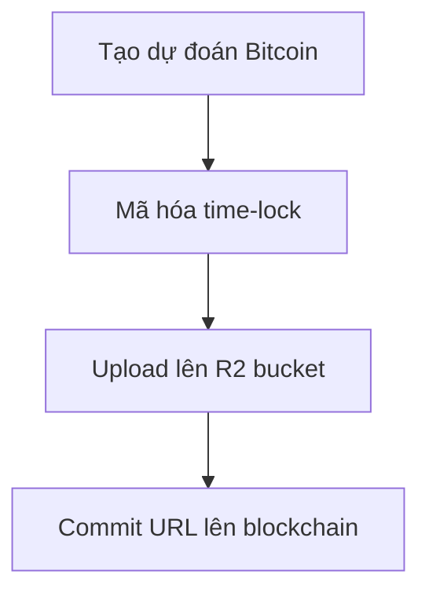
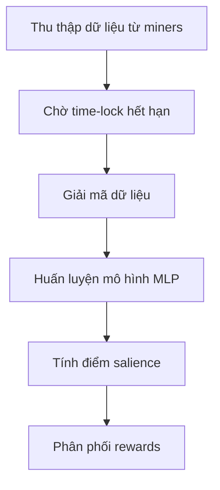

## 🎯 **MANTIS là gì?**

MANTIS là một hệ thống dự đoán giá Bitcoin sử dụng mạng lưới Bittensor. Nó hoạt động như một **cuộc thi dự đoán** trong đó:

- **Miners** (thợ mỏ): Là những người tham gia dự đoán giá Bitcoin
- **Validators** (người chấm điểm): Đánh giá độ chính xác của các dự đoán và trao phần thưởng

## 🔄 **Cách hoạt động cốt lõi:**

### **1. Miners (Thợ mỏ) làm gì?**


- **Tạo embedding**: Miners phải tạo ra 1 vector 100 số (từ -1 đến 1) dự đoán giá Bitcoin
- **Mã hóa time-lock**: Sử dụng hệ thống `tlock` + Drand network để mã hóa dự đoán với thời gian mở khóa trong tương lai (~5 phút)
- **Upload**: Đưa dữ liệu đã mã hóa lên Cloudflare R2 bucket (public)
- **Commit**: Đăng ký URL trên Bittensor blockchain

### **2. Validators (Người chấm điểm) làm gì?**


- **Thu thập**: Mỗi 5 blocks (~1 phút), tải dữ liệu từ tất cả miners
- **Giải mã**: Sau ~5 phút, sử dụng Drand signatures để giải mã
- **Đánh giá**: Dùng mô hình MLP để tính "salience" (độ quan trọng) của mỗi miner
- **Phân phối**: Trao rewards dựa trên mức độ đóng góp vào việc dự đoán

## 🏆 **Cách tính điểm và rewards:**

**Salience Score** = Đo lường mức độ đóng góp của 1 miner vào việc dự đoán Bitcoin
- Nếu loại bỏ dữ liệu của miner X → mô hình dự đoán tệ hơn nhiều → X có salience cao
- Salience cao = nhận nhiều rewards hơn

## 🔐 **Tại sao dùng Time-lock?**

- **Ngăn gian lận**: Miners không thể thay đổi dự đoán sau khi biết giá Bitcoin thực
- **Decentralized**: Sử dụng Drand network (không phụ thuộc vào 1 bên nào)
- **Minh bạch**: Tất cả đều biết thời điểm mở khóa

## 💡 **Cách tối ưu Miner để được điểm cao:**

### **1. Cải thiện chất lượng dự đoán:**
- **Feature Engineering**: Thu thập nhiều data sources (price history, volume, news sentiment, social media, on-chain metrics)
- **Model Selection**: Thử các mô hình ML khác nhau (LSTM, Transformer, ensemble)
- **Time Series Analysis**: Sử dụng kỹ thuật phân tích chuỗi thời gian chuyên nghiệp

### **2. Tối ưu embedding:**
- **Normalization**: Đảm bảo các giá trị trong [-1, 1] và có ý nghĩa
- **Dimensionality**: Tận dụng tối đa 100 dimensions
- **Feature Selection**: Chọn features có power dự đoán cao nhất

### **3. Tối ưu timing:**
- **Submit thường xuyên**: Cập nhật dự đoán mỗi phút
- **Lag optimization**: Hiểu rằng có delay 60 blocks (~12 phút) trong việc đánh giá

### **4. Technical optimization:**
```python
# Ví dụ cấu trúc miner tối ưu:
class OptimizedMiner:
    def __init__(self):
        self.models = [LSTM(), Transformer(), LinearRegression()]
        self.features = FeatureEngineer()
    
    def generate_embedding(self):
        # Thu thập data từ nhiều sources
        btc_data = self.get_market_data()
        sentiment = self.get_sentiment_data() 
        onchain = self.get_onchain_metrics()
        
        # Ensemble prediction
        predictions = []
        for model in self.models:
            pred = model.predict(btc_data, sentiment, onchain)
            predictions.append(pred)
        
        # Combine và normalize
        final_embedding = self.ensemble_predictions(predictions)
        return np.clip(final_embedding, -1, 1)
```

### **5. Infrastructure:**
- **Reliable R2 setup**: Đảm bảo uptime 99.9%
- **Monitoring**: Track performance và debug issues
- **Backup systems**: Multiple data sources để tránh downtime

## 📊 **Key Metrics để theo dõi:**
- **Salience score**: Điểm đóng góp của bạn
- **Model loss**: Độ chính xác dự đoán
- **Uptime**: Tần suất submit thành công
- **Rewards**: Token nhận được